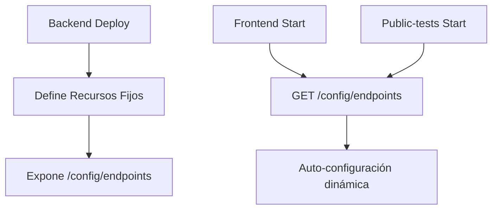

# 🚀 PLAN DE IMPLEMENTACIÓN - ARQUITECTURA DINÁMICAMENTE CONFIGURABLE

## 🎯 **OBJETIVO PRINCIPAL**

Implementar un sistema completamente dinámico donde el backend define y comunica sus propios endpoints a frontend y public-tests, eliminando URLs hardcodeadas y permitiendo recrear el stack de AWS sin romper la aplicación.

---

## 📋 **PRINCIPIOS DE IMPLEMENTACIÓN**

### ✅ **SIN DISRUPCIÓN**
- Implementar en paralelo al sistema actual
- Testear completamente antes de reemplazar
- Mantener compatibilidad durante transición
- Zero downtime en el cambio

### ✅ **ARQUITECTURA OBJETIVO**


---

## 🏗️ **HITOS DE IMPLEMENTACIÓN**

### **HITO 1: BACKEND - CONFIGURACIÓN DINÁMICA**
**Tiempo estimado: 2-3 horas**

#### **1.1 Crear Controller de Configuración**
- [ ] Crear `src/controllers/config.controller.ts`
- [ ] Endpoint `GET /config/endpoints`
- [ ] Endpoint `GET /config/system-info`
- [ ] Endpoint `GET /config/health`

#### **1.2 Servicio de Auto-Discovery**
- [ ] Crear `src/services/discovery.service.ts`
- [ ] Auto-detectar API Gateway URL actual
- [ ] Auto-detectar WebSocket URL actual
- [ ] Auto-detectar bucket S3 actual
- [ ] Auto-detectar tabla DynamoDB actual

#### **1.3 Recursos con Nombres Fijos**
- [ ] Modificar `serverless.yml` con nombres determinísticos
- [ ] S3: `${service}-${stage}-storage`
- [ ] DynamoDB: `${service}-${stage}-table`
- [ ] Outputs automáticos de URLs

---

### **HITO 2: SISTEMA DE CONFIGURACIÓN PARALELO**
**Tiempo estimado: 1-2 horas**

#### **2.1 Nuevo Cliente de Configuración**
- [ ] Crear `src/api/dynamic-config.ts` (nuevo)
- [ ] Cliente para obtener configuración del backend
- [ ] Cache de configuración con TTL
- [ ] Fallback a configuración actual

#### **2.2 Servicio de Auto-Configuración**
- [ ] Crear `src/services/auto-config.service.ts`
- [ ] Inicialización automática al start
- [ ] Retry logic para fallos de conexión
- [ ] Validación de configuración recibida

---

### **HITO 3: FRONTEND - IMPLEMENTACIÓN PARALELA**
**Tiempo estimado: 2-3 horas**

#### **3.1 Nuevo Sistema de Configuración**
- [ ] Crear `src/config/dynamic-client-config.ts` (paralelo)
- [ ] Mantener `client-config.ts` como fallback
- [ ] Sistema de inicialización asíncrona
- [ ] Validaciones de configuración

#### **3.2 Hook de Configuración Dinámica**
- [ ] Crear `src/hooks/useDynamicConfig.ts`
- [ ] Estado global de configuración
- [ ] Loading states y error handling
- [ ] Auto-retry en fallos

#### **3.3 Componente de Inicialización**
- [ ] Crear `src/components/AppInitializer.tsx`
- [ ] Loading screen durante configuración
- [ ] Error boundary para fallos de config
- [ ] Fallback a configuración estática

---

### **HITO 4: PUBLIC-TESTS - IMPLEMENTACIÓN PARALELA**
**Tiempo estimado: 1-2 horas**

#### **4.1 Sistema de Auto-Configuración**
- [ ] Crear `src/config/dynamic-config.ts` en public-tests
- [ ] Mismo patrón que frontend
- [ ] Configuración específica para public-tests

#### **4.2 Inicialización Automática**
- [ ] Modificar entrada principal
- [ ] Loading state durante configuración
- [ ] Error handling robusto

---

### **HITO 5: TESTING COMPLETO**
**Tiempo estimado: 1-2 horas**

#### **5.1 Tests de Backend**
- [ ] Unit tests para discovery.service.ts
- [ ] Integration tests para /config/endpoints
- [ ] Tests de fallback scenarios

#### **5.2 Tests de Frontend**
- [ ] Tests para useDynamicConfig hook
- [ ] Tests de inicialización
- [ ] Tests de fallback a configuración estática

#### **5.3 Tests End-to-End**
- [ ] Escenario: Stack completamente nuevo
- [ ] Escenario: URLs cambian dinámicamente
- [ ] Escenario: Backend no disponible (fallback)

---

### **HITO 6: DEPLOYMENT SCRIPTS AUTOMATIZADOS**
**Tiempo estimado: 1 hora**

#### **6.1 Script de Deploy Coordinado**
- [ ] `scripts/deploy-dynamic.sh`
- [ ] Deploy backend primero
- [ ] Wait for health check
- [ ] Deploy frontend con configuración dinámica
- [ ] Deploy public-tests

#### **6.2 Validation Scripts**
- [ ] `scripts/validate-dynamic-config.sh`
- [ ] Verificar todos los endpoints
- [ ] Verificar configuración dinámica
- [ ] Health checks completos

---

### **HITO 7: MIGRACIÓN SIN DISRUPCIÓN**
**Tiempo estimado: 30 minutos**

#### **7.1 Feature Flag**
- [ ] Variable `USE_DYNAMIC_CONFIG=true/false`
- [ ] Switch gradual sin downtime
- [ ] Rollback instantáneo si hay problemas

#### **7.2 Limpieza de Código Legacy**
- [ ] Remover archivos de configuración estática
- [ ] Limpiar imports no utilizados
- [ ] Actualizar documentación

---

## 🧪 **PLAN DE TESTING**

### **FASE 1: TESTING EN PARALELO**
```bash
# Backend
npm test -- --grep "dynamic-config"
npm run test:integration

# Frontend 
npm test -- --testPathPattern="dynamic"
npm run test:e2e -- --grep "dynamic-config"
```

### **FASE 2: TESTING DE MIGRACIÓN**
```bash
# Test con configuración estática
USE_DYNAMIC_CONFIG=false npm start

# Test con configuración dinámica
USE_DYNAMIC_CONFIG=true npm start

# Test de fallback
# (simular backend down)
```

### **FASE 3: TESTING DE STACK RECREATION**
```bash
# 1. Destruir stack actual
serverless remove

# 2. Recrear stack
serverless deploy

# 3. Verificar que frontend se auto-configura
npm run validate:dynamic
```

---

## 📁 **ESTRUCTURA DE ARCHIVOS NUEVA**

### **Backend**
```
backendV2/
├── src/
│   ├── controllers/
│   │   ├── config.controller.ts          # NUEVO
│   │   └── ...existing
│   ├── services/
│   │   ├── discovery.service.ts           # NUEVO
│   │   ├── auto-config.service.ts         # NUEVO
│   │   └── ...existing
│   └── ...existing
├── serverless.yml                         # MODIFICADO
└── ...existing
```

### **Frontend**
```
frontend/
├── src/
│   ├── config/
│   │   ├── dynamic-client-config.ts       # NUEVO
│   │   ├── client-config.ts               # MANTENER como fallback
│   │   └── ...existing
│   ├── hooks/
│   │   ├── useDynamicConfig.ts            # NUEVO
│   │   └── ...existing
│   ├── components/
│   │   ├── AppInitializer.tsx             # NUEVO
│   │   └── ...existing
│   └── ...existing
```

### **Public-tests**
```
public-tests/
├── src/
│   ├── config/
│   │   ├── dynamic-config.ts              # NUEVO
│   │   └── ...existing
│   └── ...existing
```

---

## 🔄 **FLUJO DE IMPLEMENTACIÓN DETALLADO**

### **PASO 1: PREPARAR BACKEND**
```bash
# 1. Crear archivos nuevos sin tocar existentes
touch src/controllers/config.controller.ts
touch src/services/discovery.service.ts

# 2. Implementar endpoints paralelos
# 3. Testear endpoints con curl
curl /config/endpoints

# 4. NO modificar rutas existentes aún
```

### **PASO 2: PREPARAR FRONTEND**
```bash
# 1. Crear sistema paralelo
touch src/config/dynamic-client-config.ts
touch src/hooks/useDynamicConfig.ts

# 2. Implementar con feature flag
const USE_DYNAMIC = process.env.USE_DYNAMIC_CONFIG === 'true';

# 3. Testear en modo paralelo
USE_DYNAMIC_CONFIG=true npm start
```

### **PASO 3: TESTING INTEGRAL**
```bash
# 1. Tests unitarios
npm test

# 2. Tests de integración
npm run test:integration

# 3. Simulación de stack recreation
# (en ambiente de desarrollo)
```

### **PASO 4: MIGRACIÓN GRADUAL**
```bash
# 1. Deploy con feature flag OFF
serverless deploy --param="useDynamicConfig=false"

# 2. Verificar funcionamiento normal
npm run validate

# 3. Activar feature flag
serverless deploy --param="useDynamicConfig=true"

# 4. Verificar funcionamiento dinámico
npm run validate:dynamic
```

---

## ✅ **CRITERIOS DE ÉXITO**

### **BACKEND**
- [ ] Endpoint `/config/endpoints` responde correctamente
- [ ] Auto-discovery detecta URLs actuales
- [ ] Recursos tienen nombres determinísticos
- [ ] Health checks pasan

### **FRONTEND**
- [ ] Se auto-configura al inicio
- [ ] Funciona con backend dinámico
- [ ] Fallback a configuración estática funciona
- [ ] No hay URLs hardcodeadas

### **PUBLIC-TESTS**
- [ ] Se auto-configura correctamente
- [ ] Funciona con configuración dinámica
- [ ] Maneja errores gracefully

### **INTEGRACIÓN**
- [ ] Stack destruction + recreation funciona
- [ ] URLs cambian automáticamente
- [ ] Zero downtime durante migración
- [ ] Rollback funciona correctamente

---

## 🚨 **PLAN DE ROLLBACK**

### **SI ALGO SALE MAL**
```bash
# 1. Revertir feature flag
USE_DYNAMIC_CONFIG=false

# 2. Deploy configuración estática
serverless deploy --param="useDynamicConfig=false"

# 3. Verificar sistema funciona
npm run validate

# 4. Investigar y corregir problemas
# 5. Reintentar migración
```

---

## 📊 **CRONOGRAMA ESTIMADO**

| Hito | Tiempo | Dependencias |
|------|--------|--------------|
| Hito 1 | 2-3h | Ninguna |
| Hito 2 | 1-2h | Hito 1 |
| Hito 3 | 2-3h | Hito 1, 2 |
| Hito 4 | 1-2h | Hito 1, 2 |
| Hito 5 | 1-2h | Hito 1-4 |
| Hito 6 | 1h | Hito 1-5 |
| Hito 7 | 30m | Hito 1-6 |

**TIEMPO TOTAL ESTIMADO: 8-13 horas**

---

## 🎯 **RESULTADO FINAL**

Al completar todos los hitos:

1. **✅ BACKEND** expone su configuración dinámicamente
2. **✅ FRONTEND** se auto-configura sin URLs hardcodeadas
3. **✅ PUBLIC-TESTS** funciona dinámicamente
4. **✅ STACK RECREATION** no rompe nada
5. **✅ ZERO DOWNTIME** durante migración
6. **✅ ROLLBACK** disponible en caso de problemas

**¿CONFIRMAS QUE PROCEDA CON ESTA IMPLEMENTACIÓN PASO A PASO?**