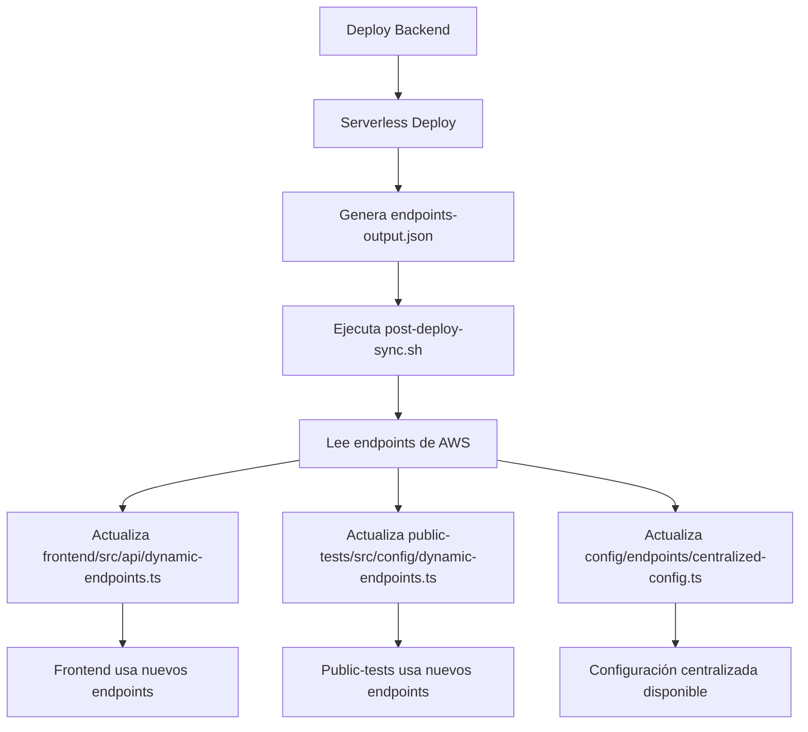

# 🔄 Sistema de Sincronización Automática de Endpoints - EmotioXV2

## 📋 Resumen

Este documento describe el sistema de sincronización automática de endpoints que comunica las rutas de AWS Lambda del backend hacia el frontend y public-tests de forma automática después de cada deploy.

## 🎯 Problema Resuelto

**ANTES**: Las rutas de AWS Lambda se generaban dinámicamente pero no se comunicaban automáticamente a los frontends, requiriendo sincronización manual y causando URLs desactualizadas.

**AHORA**: Los endpoints se sincronizan automáticamente después de cada deploy del backend, asegurando que frontend y public-tests siempre apunten a las URLs correctas de AWS Lambda.

## 🏗️ Arquitectura del Sistema

### Componentes Principales

1. **Script Post-Deploy**: `backendV2/scripts/post-deploy-sync.sh`
2. **Endpoints Dinámicos Frontend**: `frontend/src/api/dynamic-endpoints.ts`
3. **Endpoints Dinámicos Public-Tests**: `public-tests/src/config/dynamic-endpoints.ts`
4. **Configuración Centralizada**: `config/endpoints/centralized-config.ts`
5. **Estado de Sincronización**: `config/endpoints/sync-status.json`

### Flujo de Sincronización



## 🚀 Uso del Sistema

### Deploy Automático con Sincronización

```bash
# Deploy a desarrollo (automático con sincronización)
cd backendV2
npm run deploy:dev

# Deploy a producción (automático con sincronización)
cd backendV2
npm run deploy:prod
```

### Sincronización Manual

```bash
# Sincronización manual para desarrollo
cd backendV2
npm run postdeploy:dev

# Sincronización manual para producción
cd backendV2
npm run postdeploy:prod

# Ejecutar directamente el script
cd backendV2
STAGE=dev ./scripts/post-deploy-sync.sh
```

### Verificar Estado de Sincronización

```bash
# Ejecutar pruebas del sistema
./scripts/test-endpoint-sync.sh

# Ver estado actual
cat config/endpoints/sync-status.json
```

## 📁 Archivos Generados Automáticamente

### 1. Frontend - `frontend/src/api/dynamic-endpoints.ts`

```typescript
// ARCHIVO GENERADO AUTOMÁTICAMENTE POR POST-DEPLOY SYNC
export const DYNAMIC_API_ENDPOINTS = {
  http: "https://xyz123.execute-api.us-east-1.amazonaws.com/dev",
  ws: "wss://abc456.execute-api.us-east-1.amazonaws.com/dev",
  stage: "dev",
  syncedAt: "2025-01-07T15:30:00.000Z"
};

export function isEndpointsSynced(): boolean {
  return !isDevelopment &&
         API_HTTP_ENDPOINT.includes('execute-api.us-east-1.amazonaws.com') &&
         !API_HTTP_ENDPOINT.includes('placeholder');
}
```

### 2. Public-Tests - `public-tests/src/config/dynamic-endpoints.ts`

```typescript
// ARCHIVO GENERADO AUTOMÁTICAMENTE POR POST-DEPLOY SYNC
export const DYNAMIC_API_ENDPOINTS = {
  http: "https://xyz123.execute-api.us-east-1.amazonaws.com/dev",
  ws: "wss://abc456.execute-api.us-east-1.amazonaws.com/dev",
  stage: "dev",
  syncedAt: "2025-01-07T15:30:00.000Z"
};
```

### 3. Configuración Centralizada - `config/endpoints/centralized-config.ts`

```typescript
export const CENTRALIZED_API_CONFIG = {
  http: "https://xyz123.execute-api.us-east-1.amazonaws.com/dev",
  ws: "wss://abc456.execute-api.us-east-1.amazonaws.com/dev",
  stage: "dev",
  generatedAt: "2025-01-07T15:30:00.000Z",
  syncMethod: "post-deploy-script"
};
```

### 4. Estado de Sincronización - `config/endpoints/sync-status.json`

```json
{
  "lastSync": "2025-01-07T15:30:00.000Z",
  "stage": "dev",
  "httpEndpoint": "https://xyz123.execute-api.us-east-1.amazonaws.com/dev",
  "wsEndpoint": "wss://abc456.execute-api.us-east-1.amazonaws.com/dev",
  "syncMethod": "post-deploy-script",
  "filesUpdated": [
    "frontend/src/api/dynamic-endpoints.ts",
    "public-tests/src/config/dynamic-endpoints.ts",
    "config/endpoints/centralized-config.ts"
  ]
}
```

## 🔧 Configuración en los Frontends

### Frontend (Next.js)

El frontend prioriza endpoints dinámicos sobre variables de entorno:

```typescript
// frontend/src/config/api.ts
import { DYNAMIC_API_ENDPOINTS, isEndpointsSynced } from '../api/dynamic-endpoints';

export const API_BASE_URL = isEndpointsSynced()
  ? DYNAMIC_API_ENDPOINTS.http
  : (process.env.NEXT_PUBLIC_API_URL || DYNAMIC_API_ENDPOINTS.http);
```

### Public-Tests (Vite)

Public-tests usa los endpoints dinámicos automáticamente:

```typescript
// public-tests/src/config/endpoints.ts
import { DYNAMIC_API_ENDPOINTS, isEndpointsSynced } from './dynamic-endpoints';

export const API_ENDPOINTS = {
  http: isEndpointsSynced()
    ? DYNAMIC_API_ENDPOINTS.http
    : "https://fallback.execute-api.us-east-1.amazonaws.com/dev",
  stage: DYNAMIC_API_ENDPOINTS.stage
};
```

## 🔍 Detección de Modo de Desarrollo

El sistema detecta automáticamente si está en desarrollo local:

### Frontend (Next.js)
```typescript
const isDevelopment = typeof window !== 'undefined'
  ? window.location.hostname === 'localhost'
  : process.env.NODE_ENV === 'development';
```

### Public-Tests (Vite)
```typescript
const isDevelopment = import.meta.env.DEV || window.location.hostname === 'localhost';
```

## 🛠️ Scripts de Backend Actualizados

### package.json - Scripts Modificados

```json
{
  "scripts": {
    "deploy": "npm run build && serverless deploy && npm run postdeploy",
    "deploy:dev": "rm -rf dist && npm run build && serverless deploy --stage dev && npm run postdeploy:dev",
    "deploy:prod": "rm -rf dist && npm run build && serverless deploy --stage prod && npm run postdeploy:prod",
    "postdeploy": "STAGE=dev ./scripts/post-deploy-sync.sh",
    "postdeploy:dev": "STAGE=dev ./scripts/post-deploy-sync.sh",
    "postdeploy:prod": "STAGE=prod ./scripts/post-deploy-sync.sh"
  }
}
```

## 🧪 Testing y Verificación

### Script de Prueba

```bash
# Ejecutar pruebas completas del sistema
./scripts/test-endpoint-sync.sh
```

**Qué verifica:**
- ✅ Estructura de archivos correcta
- ✅ Script de sincronización ejecutable
- ✅ Generación de archivos de endpoints
- ✅ Contenido de archivos generados
- ✅ Estado de sincronización

### Verificación Manual

```bash
# Ver últimos endpoints sincronizados
grep -r "execute-api" frontend/src/api/dynamic-endpoints.ts
grep -r "execute-api" public-tests/src/config/dynamic-endpoints.ts

# Ver estado de sincronización
cat config/endpoints/sync-status.json | jq '.lastSync, .httpEndpoint'
```

## 🔄 Flujo de Trabajo Completo

### 1. Desarrollo de Backend
```bash
cd backendV2
# Hacer cambios en el código...
npm run deploy:dev  # Incluye sincronización automática
```

### 2. Verificación de Sincronización
```bash
# Los frontends ahora usan automáticamente los nuevos endpoints
./scripts/test-endpoint-sync.sh
```

### 3. Deploy a Producción
```bash
cd backendV2
npm run deploy:prod  # Incluye sincronización automática para prod
```

## 🚨 Resolución de Problemas

### Problema: Endpoints no se sincronizan

**Solución:**
```bash
# Ejecutar sincronización manual
cd backendV2
npm run postdeploy:dev

# Verificar que el archivo endpoints-output.json existe
ls -la backendV2/endpoints-output.json

# Verificar permisos del script
chmod +x backendV2/scripts/post-deploy-sync.sh
```

### Problema: Archivos no se generan

**Verificar:**
1. Permisos de escritura en directorios de destino
2. Estructura de directorios existe
3. Script se ejecuta desde el directorio correcto

```bash
# Crear directorios si no existen
mkdir -p frontend/src/api
mkdir -p public-tests/src/config
mkdir -p config/endpoints
```

### Problema: URLs siguen siendo localhost

**Verificar:**
1. La función `isEndpointsSynced()` retorna `true`
2. Los endpoints contienen `execute-api.us-east-1.amazonaws.com`
3. No contienen la palabra `placeholder`

```bash
# Verificar contenido de archivos
grep "placeholder" frontend/src/api/dynamic-endpoints.ts
grep "localhost" frontend/src/api/dynamic-endpoints.ts
```

## 📊 Monitoreo y Logs

### Logs del Script Post-Deploy

Durante la ejecución verás:
```
[INFO] 🚀 Iniciando sincronización post-deploy...
[INFO] 📁 Proyecto: /path/to/project
[INFO] 🏷️  Etapa: dev
[SUCCESS] HTTP API: https://xyz123.execute-api.us-east-1.amazonaws.com/dev
[SUCCESS] ✅ Endpoints del frontend sincronizados
[SUCCESS] ✅ Endpoints de public-tests sincronizados
[SUCCESS] ✅ Configuración centralizada actualizada
```

### Estado en Consola del Browser

Los frontends mostrarán información de sincronización en la consola:
```javascript
console.log('Endpoints sincronizados:', getSyncInfo());
// {
//   isSynced: true,
//   syncedAt: "2025-01-07T15:30:00.000Z",
//   stage: "dev",
//   endpoint: "https://xyz123.execute-api.us-east-1.amazonaws.com/dev"
// }
```

## 🔐 Seguridad

### Prevención de localhost en Producción

El sistema incluye validaciones para prevenir usar localhost en producción:

```typescript
// Validación en frontend
if (typeof window !== 'undefined' && API_BASE_URL.includes('localhost')) {
  throw new Error('Configuración de API inválida: No se permite localhost en producción');
}
```

### Variables de Entorno como Fallback

Si los endpoints dinámicos no están disponibles, el sistema usa variables de entorno como fallback:

```typescript
export const API_BASE_URL = isEndpointsSynced()
  ? DYNAMIC_API_ENDPOINTS.http
  : (process.env.NEXT_PUBLIC_API_URL || DYNAMIC_API_ENDPOINTS.http);
```

## 🎉 Beneficios del Sistema

### ✅ Para Desarrolladores
- **Cero configuración manual** después del setup inicial
- **Sincronización automática** en cada deploy
- **Detección automática** de desarrollo vs producción
- **URLs siempre actualizadas** sin intervención manual

### ✅ Para Producción
- **URLs de AWS Lambda correctas** siempre
- **Fallbacks de seguridad** si algo falla
- **Logs detallados** para debugging
- **Estado verificable** en cualquier momento

### ✅ Para el Proyecto
- **Mantenimiento reducido** de configuraciones
- **Menos errores** por URLs desactualizadas
- **Deploy más confiable** con sincronización automática
- **Mejor experiencia** de desarrollo

## 🔄 Conclusión

El sistema de sincronización automática de endpoints resuelve completamente el problema de comunicación entre el backend AWS Lambda y los frontends, proporcionando:

1. **Sincronización automática** después de cada deploy
2. **URLs siempre actualizadas** en frontend y public-tests
3. **Detección inteligente** de desarrollo vs producción
4. **Fallbacks de seguridad** para robustez
5. **Testing integrado** para verificación

**El resultado:** Los frontends siempre apuntan automáticamente a las URLs correctas de AWS Lambda sin intervención manual.
