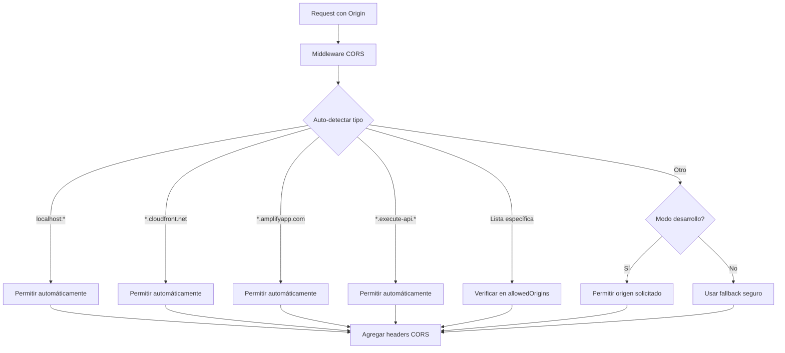

# 🔗 Configuración CORS Avanzada - EmotioXV2

## 📋 Resumen

Documentación completa de la configuración CORS (Cross-Origin Resource Sharing) para EmotioXV2, incluyendo configuración dinámica, auto-detección de orígenes y integración con la sincronización automática de endpoints.

## 🚨 PROBLEMA RESUELTO

**ANTES**:
- URLs hardcodeadas en configuración CORS
- Errores de CORS al cambiar endpoints dinámicos
- Configuración manual para nuevos orígenes
- Diferentes configuraciones para dev/prod

**AHORA**:
- **Auto-detección inteligente** de orígenes válidos
- **Sincronización automática** con endpoints dinámicos
- **Configuración unificada** para todas las plataformas
- **Logs detallados** para debugging

## 🏗️ Arquitectura CORS

### Componentes del Sistema CORS



### 1. **Middleware Inteligente**: `backendV2/src/middlewares/cors.ts`
- Auto-detección de patrones de orígenes
- Lógica diferente para desarrollo vs producción
- Logs detallados para debugging

### 2. **Configuración S3**: `backendV2/resources.yml`
- CORS para archivos estáticos
- Orígenes específicos configurados
- Métodos HTTP permitidos

### 3. **Variables de Entorno**: `backendV2/environment-variables.yml`
- `ALLOWED_ORIGIN` configurable
- Fallbacks seguros por defecto

### 4. **Configuración Dinámica**: `config/endpoints/cors-config.json`
- Actualizada automáticamente en cada deploy
- Incluye endpoints detectados dinámicamente

## 🔧 Configuración Detallada

### Auto-detección de Orígenes

El middleware detecta automáticamente estos patrones:

```typescript
// 🖥️ Desarrollo local
/^http:\/\/localhost:\d+$/           // http://localhost:3000, etc.
/^http:\/\/(127\.0\.0\.1|0\.0\.0\.0):\d+$/  // IPs locales

// 📱 Public-tests
/public-tests|tests\./               // Cualquier URL con "public-tests" o "tests."

// ☁️ CloudFront
/\.cloudfront\.net$/                 // *.cloudfront.net

// 🔗 Amplify
/\.amplifyapp\.com$/                 // *.amplifyapp.com

// 🚀 API Gateway
/\.execute-api\./                    // *.execute-api.*.amazonaws.com
```

### Orígenes Específicos Configurados

```typescript
const defaultOrigins = [
  // 🖥️ Desarrollo local
  'http://localhost:3000',        // Frontend local (Next.js)
  'http://localhost:4700',        // Public-tests local (Vite)
  'http://localhost:5173',        // Vite alternativo
  'http://localhost:5174',        // Vite alternativo 2
  'http://localhost:8080',        // Otros puertos comunes
  'http://localhost:8081',        // Otros puertos comunes

  // ☁️ CloudFront (Producción)
  'https://d2s9nr0bm47yl1.cloudfront.net',  // Frontend CloudFront
  'https://d2zt8ia21te5mv.cloudfront.net',  // Public-tests CloudFront

  // 🖥️ EC2 (Si aplicable)
  'http://54.90.132.233:3000',    // Frontend EC2

  // 🔗 Amplify (Si aplicable)
  'https://main.d1234567890.amplifyapp.com',  // Ejemplo Amplify

  // 🌍 Dominios personalizados
  'https://emotioxv2.com',        // Dominio de producción
  'https://app.emotioxv2.com',    // Subdominio de app
  'https://tests.emotioxv2.com',  // Subdominio de tests
];
```

## 🚀 Uso y Comandos

### Sincronización Automática

La configuración CORS se actualiza automáticamente en cada deploy:

```bash
# Deploy con sincronización automática de CORS
cd backendV2
npm run deploy:dev     # ✅ Incluye actualización CORS
npm run deploy:prod    # ✅ Incluye actualización CORS
```

### Actualización Manual CORS

```bash
# Actualizar solo configuraciones CORS
cd backendV2
./scripts/update-cors-config.sh

# Verificar configuración actual
cat ../config/endpoints/cors-config.json
```

### Configuración Personalizada

```bash
# Agregar orígenes específicos
export ALLOWED_ORIGIN='https://mi-dominio.com,https://otro-dominio.com'
npm run deploy:dev

# Configuración temporal para testing
export ALLOWED_ORIGIN='http://localhost:8080,https://test.example.com'
npm run postdeploy:dev
```

## 🔍 Debugging CORS

### Logs en AWS Lambda

El middleware produce logs detallados que puedes ver en CloudWatch:

```bash
# Ver logs de Lambda
cd backendV2
npm run logs
```

**Ejemplos de logs CORS:**

```
🔗 CORS: Dominio local permitido automáticamente: http://localhost:4700
📱 CORS: Origen public-tests permitido automáticamente: https://tests.example.com
☁️ CORS: CloudFront permitido automáticamente: https://d2s9nr0bm47yl1.cloudfront.net
✅ CORS: Origen encontrado en lista permitida: https://app.emotioxv2.com
🔧 CORS (DEV): Usando origen permisivo: http://localhost:3000
🔒 CORS (PROD): Usando origen fallback seguro: https://d2zt8ia21te5mv.cloudfront.net
```

### Verificar Headers CORS

```bash
# Probar CORS desde frontend local
curl -H "Origin: http://localhost:3000" \
     -H "Access-Control-Request-Method: GET" \
     -H "Access-Control-Request-Headers: Content-Type,Authorization" \
     -X OPTIONS \
     https://tu-api.execute-api.us-east-1.amazonaws.com/dev/research

# Probar desde public-tests local
curl -H "Origin: http://localhost:4700" \
     -H "Access-Control-Request-Method: POST" \
     -X OPTIONS \
     https://tu-api.execute-api.us-east-1.amazonaws.com/dev/participants
```

### Headers CORS Devueltos

```http
Access-Control-Allow-Origin: http://localhost:4700
Access-Control-Allow-Credentials: true
Access-Control-Allow-Methods: GET,POST,PUT,DELETE,OPTIONS,PATCH
Access-Control-Allow-Headers: Content-Type,Authorization,X-Amz-Date,X-Api-Key,X-Amz-Security-Token,X-Requested-With,Accept,Origin,Cache-Control,Pragma
Access-Control-Max-Age: 86400
```

## 📊 Configuración por Entorno

### Desarrollo (dev)

```typescript
// Configuración permisiva para desarrollo
if (process.env.NODE_ENV === 'development' || process.env.STAGE === 'dev') {
  // Permitir cualquier origen solicitado
  accessControlAllowOrigin = requestOrigin || allowedOrigins[0];
  console.log(`🔧 CORS (DEV): Usando origen permisivo: ${accessControlAllowOrigin}`);
}
```

**Comportamiento en desarrollo:**
- ✅ **Todos los localhost** permitidos automáticamente
- ✅ **Orígenes solicitados** aceptados por defecto
- ✅ **Logs detallados** habilitados
- ✅ **Fallbacks permisivos**

### Producción (prod)

```typescript
// Configuración restrictiva para producción
else {
  // Usar fallback seguro
  accessControlAllowOrigin = allowedOrigins.find(o => o.includes('cloudfront')) ||
                           allowedOrigins[0] ||
                           'https://d2zt8ia21te5mv.cloudfront.net';
  console.log(`🔒 CORS (PROD): Usando origen fallback seguro: ${accessControlAllowOrigin}`);
}
```

**Comportamiento en producción:**
- 🔒 **Solo orígenes autorizados** explícitamente
- 🔒 **Fallback a CloudFront** como seguro
- 🔒 **Auto-detección restrictiva** (solo patrones seguros)
- 🔒 **Logs de seguridad** para auditoría

## 🛠️ Configuración Avanzada

### Variables de Entorno

```bash
# En .env o variables de sistema
ALLOWED_ORIGIN=https://prod1.com,https://prod2.com,https://staging.com
NODE_ENV=production
STAGE=prod
```

### Configuración S3 CORS

El archivo `backendV2/resources.yml` incluye configuración CORS para S3:

```yaml
CorsConfiguration:
  CorsRules:
    - AllowedHeaders:
        - '*'
      AllowedMethods:
        - GET
        - PUT
        - POST
        - DELETE
        - HEAD
      AllowedOrigins:
        - 'http://localhost:3000'        # Frontend desarrollo
        - 'http://localhost:4700'        # Public-tests desarrollo
        - 'https://d2s9nr0bm47yl1.cloudfront.net'  # Frontend CloudFront
        - 'https://d2zt8ia21te5mv.cloudfront.net'  # Public-tests CloudFront
        - '*'                            # Fallback para desarrollo
      MaxAge: 3000
```

### Configuración API Gateway

En `backendV2/function-definitions.yml`:

```yaml
# CORS habilitado para todas las funciones
functions:
  api:
    events:
      - http:
          path: /{proxy+}
          method: ANY
          cors: true  # ✅ CORS automático de API Gateway
```

## 🧪 Testing CORS

### Script de Testing

```bash
# Probar configuración CORS completa
./scripts/test-endpoint-sync.sh

# Probar solo CORS
cd backendV2
./scripts/update-cors-config.sh
```

### Testing Manual

```javascript
// En el browser console (Frontend)
fetch('https://tu-api.execute-api.us-east-1.amazonaws.com/dev/research', {
  method: 'GET',
  headers: {
    'Content-Type': 'application/json',
    'Authorization': 'Bearer tu-token'
  }
})
.then(response => console.log('✅ CORS funcionando:', response.status))
.catch(error => console.error('❌ Error CORS:', error));
```

```javascript
// En el browser console (Public-tests)
fetch('https://tu-api.execute-api.us-east-1.amazonaws.com/dev/participants', {
  method: 'POST',
  headers: {
    'Content-Type': 'application/json'
  },
  body: JSON.stringify({ test: true })
})
.then(response => console.log('✅ CORS funcionando:', response.status))
.catch(error => console.error('❌ Error CORS:', error));
```

## 🚨 Solución de Problemas

### Error: "CORS policy blocks request"

**Síntomas:**
```
Access to fetch at 'https://api...' from origin 'http://localhost:3000'
has been blocked by CORS policy: No 'Access-Control-Allow-Origin' header
```

**Soluciones:**

1. **Verificar logs de Lambda:**
```bash
cd backendV2
npm run logs
# Buscar mensajes CORS en los logs
```

2. **Verificar configuración actual:**
```bash
# Ver orígenes configurados
cat ../config/endpoints/cors-config.json

# Verificar middleware
grep -A 20 "getCorsHeaders" src/middlewares/cors.ts
```

3. **Forzar sincronización:**
```bash
# Re-sincronizar configuración CORS
npm run postdeploy:dev
./scripts/update-cors-config.sh
```

4. **Configuración temporal:**
```bash
# Para debugging, permitir origen específico
export ALLOWED_ORIGIN="http://localhost:3000,$(cat ../config/endpoints/cors-config.json | jq -r '.allowedOrigins[]' | tr '\n' ',')"
npm run postdeploy:dev
```

### Error: "Preflight request fails"

**Síntomas:**
```
OPTIONS request fails with 403 or 404
```

**Soluciones:**

1. **Verificar que OPTIONS está habilitado:**
```bash
# Verificar función de API incluye cors: true
grep -A 5 "cors:" function-definitions.yml
```

2. **Verificar middleware de OPTIONS:**
```bash
# Verificar que corsMiddleware maneja OPTIONS
grep -A 10 "OPTIONS" src/middlewares/cors.ts
```

3. **Test directo de OPTIONS:**
```bash
curl -X OPTIONS \
     -H "Origin: http://localhost:4700" \
     -H "Access-Control-Request-Method: POST" \
     -H "Access-Control-Request-Headers: Content-Type" \
     https://tu-api.execute-api.us-east-1.amazonaws.com/dev/participants
```

### Error: "Credentials not allowed"

**Síntomas:**
```
CORS policy: The value of the 'Access-Control-Allow-Origin' header
must not be the wildcard '*' when credentials are included
```

**Solución:**
El middleware ya maneja esto correctamente estableciendo el origen específico en lugar de '*' cuando se usan credenciales.

### Error: Headers no permitidos

**Síntomas:**
```
CORS policy: Request header 'authorization' is not allowed by
Access-Control-Allow-Headers in preflight response
```

**Solución:**
El middleware incluye headers comunes automáticamente:
```typescript
'Access-Control-Allow-Headers': 'Content-Type,Authorization,X-Amz-Date,X-Api-Key,X-Amz-Security-Token,X-Requested-With,Accept,Origin,Cache-Control,Pragma'
```

## 📈 Monitoreo CORS

### Métricas en CloudWatch

Los logs CORS aparecen en CloudWatch Logs con los siguientes patrones:
- `🔗 CORS:` - Información general CORS
- `📱 CORS:` - Específico para public-tests
- `☁️ CORS:` - Específico para CloudFront
- `✅ CORS:` - Origen aceptado exitosamente
- `🔧 CORS (DEV):` - Comportamiento de desarrollo
- `🔒 CORS (PROD):` - Comportamiento de producción

### Alertas Recomendadas

```bash
# Configurar alertas para errores CORS frecuentes
aws logs put-metric-filter \
  --log-group-name "/aws/lambda/emotioxv2-backend-dev-api" \
  --filter-name "CORS-Errors" \
  --filter-pattern "[timestamp, requestId, level, message=\"*CORS*fallback*\"]" \
  --metric-transformations \
    metricName=CORSFallbackUsed,metricNamespace=EmotioXV2,metricValue=1
```

## 🎉 Beneficios del Sistema CORS

### ✅ Para Desarrolladores
- **Cero configuración manual** para orígenes comunes
- **Auto-detección inteligente** de patrones de desarrollo
- **Logs detallados** para debugging rápido
- **Configuración unificada** entre dev y prod

### ✅ Para Producción
- **Seguridad mejorada** con fallbacks restrictivos
- **Flexibilidad automática** para nuevos endpoints
- **Monitoreo integrado** con CloudWatch
- **Configuración auditada** en archivos de estado

### ✅ Para el Proyecto
- **Mantenimiento reducido** de listas de orígenes
- **Sincronización automática** con endpoints dinámicos
- **Compatibilidad total** con todas las plataformas de deploy
- **Experiencia de desarrollo** sin fricción

## 🔄 Conclusión

El sistema CORS de EmotioXV2 proporciona:

1. **Configuración automática** que se adapta a cambios de endpoints
2. **Auto-detección inteligente** de orígenes válidos
3. **Diferenciación segura** entre desarrollo y producción
4. **Debugging comprehensivo** con logs detallados
5. **Integración total** con el sistema de sincronización de endpoints

**Resultado final:** Los frontends pueden comunicarse con el backend sin errores CORS, independientemente de dónde estén desplegados o qué endpoints usen, todo configurado automáticamente.
